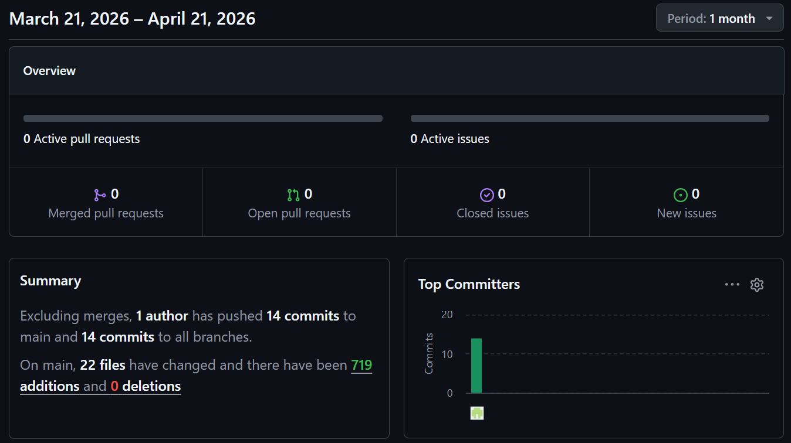

# MEDTWT-Projekt Sprint #2

- **Name:** Jannis Pal  
- **Klasse:** 2BHITM  
- **Projektname:** Protocol: Reconstruction  
- **GitHub-Repo:** https://github.com/htl-leo-medtwt-projects/2526-2bhitm-sommerprojekt-Jannisp09/

 

# 🚀 Sprint #2

## 🎯 Ziele für Sprint #3

- Einbindung der JSON-Datei ins Gameplay-System  
- Mehrere Level-Struktur  
- Code-Eingabe-System:
  - falscher Code → HP wird reduziert  
  - HP = 0 → Game Over  
- Background Music System  
- Sammelbare Items (Pickups)

 

## ✨ Neu implementiert

- Generierung des Sprites  
- Einbindung einer eigenen Schriftart  
- Erstellung der Script-Dateien:
  - `script_keyEvents.js`
  - `script-loop.js`
  - `script-player.js`
- JSON-System inkl. Audio-Generierung (ElevenLabs TTS)
- HUD-Anzeige (HP, Level, UI-Elemente)
- Inventar-System (On-Click)
- Sprite-Logik & Bewegungsmechanik
- Kollisionssystem (Spieler kann Map nicht verlassen)
- Inventar als Pop-Up Interface
- Neue UserSetup-Seite

 

## Screenshot
