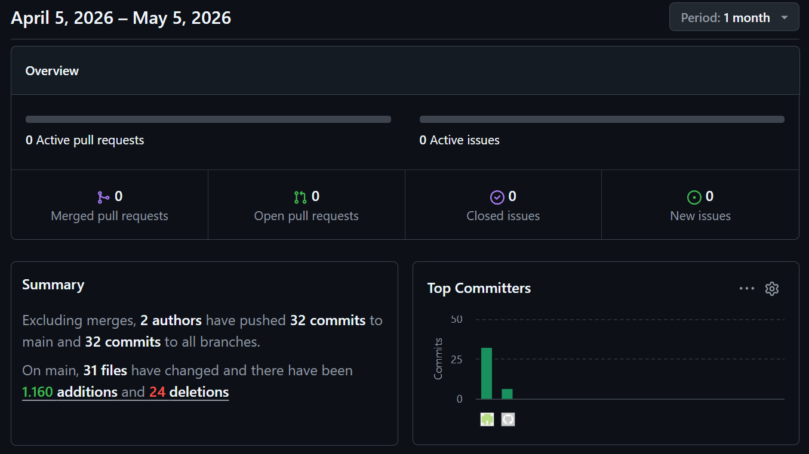

# MEDTWT-Projekt Sprint #3

- **Name:** Jannis Pal  
- **Klasse:** 2BHITM  
- **Projektname:** Protocol: Reconstruction  
- **GitHub-Repo:** https://github.com/htl-leo-medtwt-projects/2526-2bhitm-sommerprojekt-Jannisp09/

 

# 🚀 Sprint #3

## 🎯 Ziele für Sprint #4

- Einbindung der JSON-Datei ins Gameplay-System
- Local Storage
- Level 3-6 (exkl. Finale und GameEnd)

 

## ✨ Neu implementiert

- Level 1: Codeingabe und Korrektur
- Code-Eingabe-System:
  - falscher Code → HP wird reduziert  
  - HP = 0 → Game Over 
- GSAP-Library
- Erstellung der Script-Dateien:
  - `script-detect_collision.js`
- funktionierende HUD-Anzeige (HP, Level, UI-Elemente)
- Berührung der "?"-Box = Öffnet SolutionUI
- Generierung von Bild Level 2
- Transitionvideo zu Level 2

 

## ⚠️ Probleme beim Programmieren

- Animation des StartButton wurde durch GSAP unterbrochen
- Sprint bewegte sich nicht beim Bau von Level 2

 

## Screenshot
