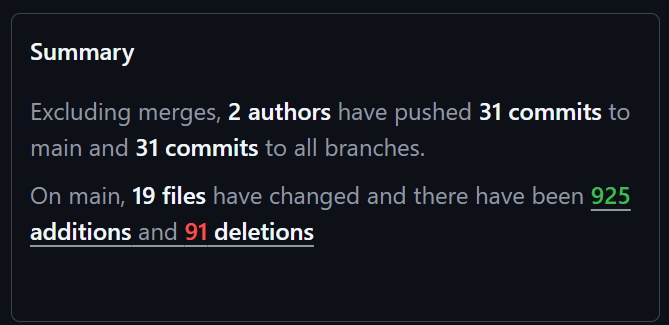

# MEDTWT-Projekt Sprint #4

- **Name:** Jannis Pal  
- **Klasse:** 2BHITM  
- **Projektname:** Protocol: Reconstruction  
- **GitHub-Repo:** https://github.com/htl-leo-medtwt-projects/2526-2bhitm-sommerprojekt-Jannisp09/

 

# 🚀 Sprint #4

## 🎯 Ziele für Sprint #5

- Einsammelm
- Level 3 und Finale (und GameEnd)
- Vollständiges Audio & Dialoge

 

## ✨ Neu implementiert

- Dynamische Ladung des Sprites und anderen Codestücken
- Level 2: Tipps
- Level 2: Lösen teils integriert

 

## ⚠️ Probleme

- 🤒 Da ich nach der Sportwoche krank war, konnte ich meine Pläne nicht umsetzen, deshalb werde ich im nächsten Sprint den Rest erledigen müssen

 

## Screenshot
