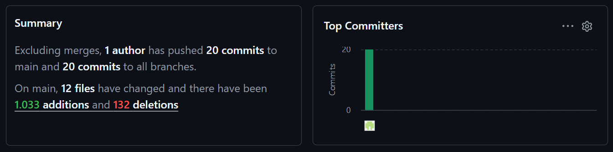

# MEDTWT-Projekt Sprint #5

- **Name:** Jannis Pal  
- **Klasse:** 2BHITM  
- **Projektname:** Protocol: Reconstruction  
- **GitHub-Repo:** https://github.com/htl-leo-medtwt-projects/2526-2bhitm-sommerprojekt-Jannisp09/

 

# 🚀 Sprint #4

## ✨ Neu implementiert

- Level 3 gebaut
- Finales Level geplant, Bilder generiert und neue Rätsel vorbereitet

 

## Screenshot
